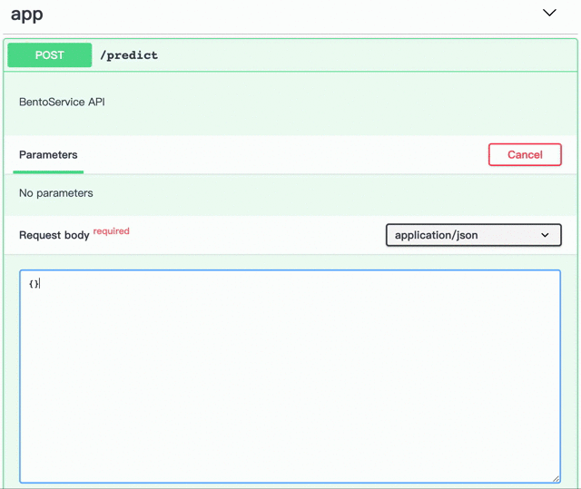

# HOWDE_DEPRESSION_DIAGONIS 
## Purpose 
To diagnose and classify whether the text in the *diary* shows stress or not. After comparing Bert, TF-IDF, Word2Vec + TF-IDF, since Bert shows the best results on the test set, it will be used for classification. In addition, the bento-ml is meeting some errors in some versions of TensorFlow so TF-IDF, Word2Vec + TF-IDF model shall not be used.  

# Stress Analysis in Social Media 
Social media is one of the most common way for people to express "stress" nowadays. Therefore, I conducted a sentiment 
analysis to extract information and identify stress from social media posts. This project leverages the power of 
natural language processing (NLP) and supervised learning to build models that accurately classify stressful and 
non-stressful posts. It was inspired by the newly published paper called
[Dreaddit: A Reddit Dataset for Stress Analysis in Social Media](https://arxiv.org/abs/1911.00133).

For more information, please check out [Slides](https://bit.ly/37WNKbu)


## Requisites
- MacOS or Linux
- Python 3.7.4
- conda 
- pip
- GPU (To run BERT model)

## Setup
This project requires Python 3.7.4 and conda environment. To setup the environment, please follow these steps:

- Create a new conda virtual environment in local or cloud services
```
conda create -n new_env python=3.7.4 
conda activate new_env 
```
- Clone the github repository
```
- Install the required packages in the conda environment
```
cd Insight_Stress_Analysis/build
conda install pip
pip install -r requirements.txt
```
- If have problem install BentoML with requirement.txt file
```
pip install bentoml
```
- For first time using running the project, you need to download some important data packages
```
cd Insight_Stress_Analysis
python config.py
```
### Additional Setup
- If you have GPU and would like to run the BERT model, install:
```
pip install tensorflow-gpu==1.15
```

## Run Word2Vec Model with REST API
I served the stress analysis model with Python BentoML package, which is a package that supports serving and 
deploying machine learning models to production API in the cloud. The model I used for production is 
"Word2Vec + Tf-IDF" model. 

### Run REST API Locally
Serve the model to REST API with Python bentoml package.
```
bentoml serve bentoml/repository/WordEmbeddingModel/20200206150926_DCA9FA
```

#### Send Predict Request
- After you serve the model, you can run REST API on http://127.0.0.1:5000/ Click the  "app/predict" function and input the texts you want to predict. You can input one or multiple sentences. Here is an valid input example:
```
["I like you", "I feel stressful"]
```
Check "Analysis" section for API demo. 

- or you can also run the API directly in terminal by sending prediction request with curl from command line. 
Here is an example:
```
curl -i \
  --header "Content-Type: application/json" \
  --request POST \
  --data '["I like you", "I feel stressful"]' \
  http://localhost:5000/predict
```
- or with python and request library:
```
import requests
response = requests.post("http://127.0.0.1:5000/predict", json=["I like you", "I feel stressful"])
print(response.text)
```
Replace ["I like you", "I feel stressful"] to your own text.

### Run REST API on cloud service
- I have deployed the API on google cloud platform. Check this link to run the API without any installation: https://sentiment-ghxotopljq-uw.a.run.app 
- If you would like to deploy the model to your own cloud service, please check BentoML's 
[Deploy Model Document](https://docs.bentoml.org/en/latest/deployment/index.html).

## Analysis
In this project, I trained the dataset with three feature extraction models TF-IDF, Word2Vec with TF-IDF as weights and 
BERT. After extracting the features, I trained the features with traditional classification models such as logistic
regression, SVM and random forest. Besides, BERT uses a fine tuning neural network to classify the text based on sentences. 

### Overall model results
- Recall is the most important metric because we want to identify the stress posts accurately. However, we also want to prevent
misclassifying a lot of non-stress posts as stress post. 
- Although word2vec+tfidf with random forest has the highest recall, it also misclassified a lot of non-stress as stress 
(low precision). 
    - Some sentences may look non-stress, but they include words with high tfidf weights in stress posts (from train set),
    which may make them be classified as stress.
    
- BERT is the most stable model in this case, with a balanced FP and FN. 
- Both model can predict whether the text is stressful or non stressful and provide a confidence score

| Feature Extraction Model | Best Classification Model | Precision | Recall | F1-Score |
| :---------------- | :-------------  | :-------- |:-------| :------- |
| TF-IDF            | Logistic Regression         | 75.1%     | 75.7%  | 75.4%    |
| Word2Vec + TF-IDF | Random Forest   | 69.4%     | 84.8%  | 76.3%    |
| BERT              | Fine Tuning NN  | 80.8%     | 81.0%  | 80.9%    |

### Word2Vec (with TF-IDF) Prediction 


### BERT Prediction


For more information, please check notebook directory to see the analysis results of different models.

### HOWDE DEPRESSION DIAGONIS SYSTEM 
- Based on those accuratecy (precision, recall, F1-score) we can conclude Bert is the most stable and precisive model. However, we still keep TF-IDF and Word2Vec + TF-IDF models as submodels to continue update the accuratecy over time and check it with Bert. 
- Since Bert is the most stable model, we will run and only need to execute code in Stress_Analysis_Bert Jupiter notebook. 
- After the first training which take quite long, we will input the some sentences and the output is to classify wether that user is stress or not. The confidence output on the left represents the nonstress probabilities (normalization) while the other represents the stress probabilies(normalization). The closer the confidence get to 0, to more likely the bert model labels it.
